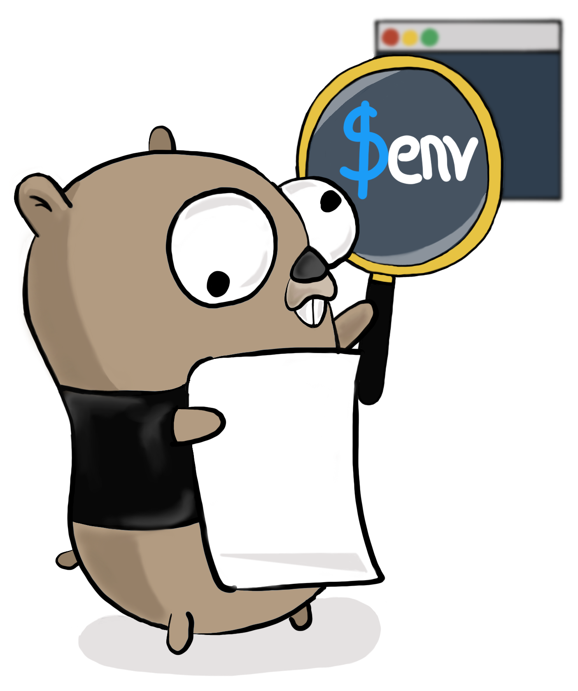

<p align="center"></p>

[![Go Report Card][linkGoReportCardProjectBadge]][linkGoReportCardProject]
[![codecov][linkCodecovProjectBadge]][linkCodecovProject]
[![GitHub Tag][linkGitHubProjectTagBadge]][linkGitHubProject]
[![Build Status][linkGitHubActionsProjectTestBadge]][linkGitHubActionsProject]
[![Build Status][linkGitHubActionsProjectReleaseBadge]][linkGitHubActionsProject]
[![Docker Hub][linkDockerHubProjectBadge]][linkDockerHubProject]
[![Docker Hub Pulls Badge][LinkDockerHubProjectPullsBadge]][linkDockerHubProject]
[![License][linkLicenseBadge]][linkLicense]

# Envvars

Envvars, a command line tool written in Go, provides a way to describe the environment variables of a project and ensures they are defined before testing, building, and deploying. It also generates an env file to be used by other applications such as Docker and Compose.

## Releases and current state

Envvars is in its early stage and its API is not stable. Envvars will be production ready when it reaches `v1.0.0`.

You are encouraged to try envvars, [share your feedback and contribute to it][linkContributing].

See [Automation & Configuration][linkAutomationAndConfiguration] for more details.

## Declaration File

The declaration file (written in [YAML][linkYAML]) is the core of Envvars. It declares all the environment variables used by a project.

Envvars is looking for the declaration file `envvars.yml` by default. A different file can be passed with the flag `-f path/to/declarationfile.yml`.

```yml
tags:
  - name: deploy
    desc: tag used when deploying

envvars:
  - name: ENV
    desc: Application stage (dev, qa, preprod, prod)
    tags:
      - deploy
    optional: true
    example: dev
```

| Field            |      Type      | Required | Description                                                                                                                        |
|------------------|:--------------:|:--------:|------------------------------------------------------------------------------------------------------------------------------------|
| tags             |      list      |    no    | List of tags to be used for targeting a subset of environment variables                                                            |
| tags.name        |     string     |    yes   | Unique tag name                                                                                                                    |
| tags.desc        |     string     |    no    | Meaningful description of the tag                                                                                                  |
| envvars          |      list      |    yes   | List of environment variables                                                                                                      |
| envvars.name     |     string     |    yes   | Unique environment variable name                                                                                                   |
| envvars.desc     |     string     |    no    | Meaningful description of the environment variable                                                                                 |
| envvars.tags     | list of string |    no    | List of tags for the environment variable. Each tag must be declared in the "tags" field.                                          |
| envvars.optional |      bool      |    no    | Allows the environment variable to be empty or not defined. It is best to avoid it unless your application accepts an empty value. |
| envvars.example  |     string     |    no    | Example value for the environment variable.                                                                                        |

## Installation

```bash
# with go get
$ go get -u github.com/flemay/envvars

# or use the tiny docker image (< 5 MB)
$ docker run --rm flemay/envvars
```

## Usage

```bash
# create a declaration file envvars.yml
# envvars:
#   - name: ECHO
#     example: Hello World
$ envvars init

# validate the declaration file if it contains errors
$ envvars validate

# ensure the environment variables comply with the declaration file
$ envvars ensure
# Error: environment variable ECHO is not defined
# set ECHO with empty value
$ export ECHO=""
$ envvars ensure
# Error: environment variable ECHO is empty
# set ECHO with non-empty value
$ export ECHO="helloworld"
$ envvars ensure

# create an env file
$ envvars envfile
$ cat .env
# ECHO

# create an env file with the example value
$ envvars envfile -overwrite -example
$ cat .env
# ECHO=Hello World

# explore
$ envvars --help
```

## Guidelines

### Documentation is your best friend

The field `desc` should be used if the name of the tag or environment variable is not self-explanatory. This helps anyone new to the project, or juggling with many projects at once, to understand every environment variable, and tag.

## The 3 Musketeers

Envvars fits nicely with the [3 Musketeers][link3Musketeers] for managing the environment variables used by an application.

## Contributing

Contributions are greatly appreciated. Everyone can contribute and [here][linkContributing] are different ways.


[linkAutomationAndConfiguration]: ./docs/automation_and_configuration.md
[linkLicense]: LICENSE
[linkContributing]: CONTRIBUTING.md

[linkYAML]: http://yaml.org/spec/1.2/spec.html
[link3Musketeers]: https://3musketeers.io
[linkGitHubActionsProjectTestBadge]: https://github.com/flemay/envvars/workflows/Test/badge.svg
[linkGitHubActionsProjectReleaseBadge]: https://github.com/flemay/envvars/workflows/Release/badge.svg
[linkGitHubActionsProject]: https://github.com/flemay/envvars/actions
[linkDockerHubProjectBadge]: https://img.shields.io/badge/repository-dockerhub-blue.svg
[linkDockerHubProject]: https://hub.docker.com/r/flemay/envvars
[LinkDockerHubProjectPullsBadge]: https://img.shields.io/docker/pulls/flemay/envvars
[linkDockerHub]: https://hub.docker.com
[linkCodecovProjectBadge]: https://codecov.io/gh/flemay/envvars/branch/master/graph/badge.svg
[linkCodecovProject]: https://codecov.io/gh/flemay/envvars
[linkGoReportCardProjectBadge]: https://goreportcard.com/badge/github.com/flemay/envvars
[linkGoReportCardProject]: https://goreportcard.com/report/github.com/flemay/envvars
[linkLicenseBadge]: https://img.shields.io/dub/l/vibe-d.svg
[linkGitHubProjectTagBadge]: https://img.shields.io/github/tag/flemay/envvars.svg
[linkGitHubProject]: https://github.com/flemay/envvars